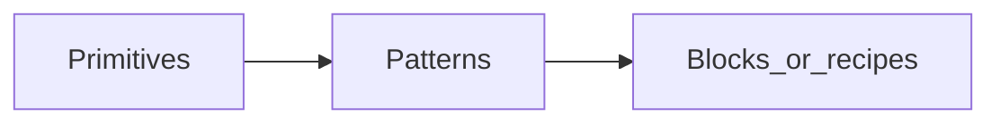

# Component authoring

This page ties together **where components live**, **how we document them** (compared to large design-system docs like Vuetify), and a **copy-paste prompt** for agents when you paste a big spec.

Read [Architecture and tiers](./architecture) first for the primitive / pattern / block mental model.

## Structure

### Tiers

| Tier | Role | Examples |
|------|------|----------|
| **Primitive** | One DOM role, one job | `GkButton`, `GkInput`, `GkStack` |
| **Pattern** | Composes primitives + optional provide/inject | `GkField`, `GkRadioGroup` |
| **Block / recipe** | Page or product-specific | Usually in the **app** or as **copy-paste examples** in docs—not exported unless truly generic |

### Repository layout

- **Tokens:** single source in `src/tokens/tokens.css` and `src/tokens/tokens.ts` (see [Design tokens](./tokens)). Components use **`var(--gk-*)`**, not ad hoc hex (add tokens when you need new semantics).
- **Form primitives:** `src/vue/components/form/<name>/` (e.g. `GkInput`, `GkField`, `GkSelect`).
- **Other primitives:** `src/vue/components/<name>/` (e.g. `GkButton`, `GkAlert`). You can introduce `layout/<name>/` when you standardize layout-only widgets; see [Build and bundling](./build-and-bundling).
- **Composables:** shared behavior in `src/vue/composables/`—prefer small composables only when logic is **reused** or **testable** in isolation.
- **Public API:** named exports from `@god-plan/god-kit/vue`, optional barrels `@god-plan/god-kit/vue/form` and `@god-plan/god-kit/vue/layout`. Semver + changelog for release-worthy changes.



## Documentation outline (Vuetify-style → God Kit)

Large libraries often document with custom MDX blocks (`<ExamplesExample />`, `<PageFeatures />`, auto-generated API). **God Kit uses VitePress** with **one demo component per primitive** where possible.

| Typical Vuetify / large DS section | God Kit equivalent |
|-----------------------------------|-------------------|
| YAML `meta` (nav, keywords, related) | VitePress **frontmatter**: `title`, `description`, `outline`. Related links: manual “See also” bullets or sidebar |
| Usage + hero | Short intro + **`<DemoGk… />`** registered in [theme/index.ts](../.vitepress/theme/index.ts) |
| API (generated) | **Markdown tables**: Props / Events / Slots (hand-maintained, kept short) |
| Anatomy + images | Optional **Anatomy** subsection (bullets or one image); skip if redundant |
| Props grouped (Density, Size, …) with many live examples | **One** demo file can show several states, or add subsections with **code fences** only—avoid dozens of separate embeds unless automated |
| Slots (prepend/append/loader) | Slots table + 1–2 examples if non-trivial |
| Many “real world” examples | **2–4** realistic snippets (forms, dialogs)—not 15+ per component |
| Global configuration / aliasing | **Out of scope** unless we ship a real API—document **app-level wrappers** or recipes instead |
| SASS variables | **Out of scope**—tokens live in CSS variables; document **token names** when relevant |
| “Defaults side effects” (button inside toolbar, card, …) | **Out of scope** in the kit—handle with **parent layout in the app** or a **docs recipe** |
| Accessibility | Short **Accessibility** subsection: keyboard, labels, focus—link to WCAG where useful |

## Master prompt for agents (copy-paste)

Use this when you want an agent to implement or extend a primitive and you can paste a long reference (e.g. Vuetify `VBtn` source or docs).

````markdown
You are implementing a component for **@god-plan/god-kit** (Vue 3 + Vite).

## Package rules (must follow)

- Prefix: **Gk***. Single-file components under:
  - **Form-related:** `src/vue/components/form/<kebab-name>/Gk<Pascal>.vue`
  - **Otherwise:** `src/vue/components/<kebab-name>/Gk<Pascal>.vue` (or `layout/<kebab-name>/` if we agreed layout-only)
- Styling: **scoped CSS** + **design tokens** (`var(--gk-*)` from `tokens.css`). No one-off hex except new tokens in `tokens.css` / `tokens.ts` with justification.
- Accessibility: label/aria patterns consistent with **GkField** / **GK_FIELD** inject where applicable; keyboard support for the native role.
- Tests: `Gk<Pascal>.spec.ts` + `Gk<Pascal>.a11y.spec.ts` (axe helper in `src/vue/test-utils/axe.ts`).
- Docs: `docs/components/...` (and `form/...` if form), demo `docs/.vitepress/components/demos/...`, register demo in `docs/.vitepress/theme/index.ts`, sidebar in `docs/.vitepress/config.ts`, row in `docs/components/index.md`.
- Exports: add to `src/vue/index.ts` and `src/vue/form.ts` or `layout.ts` if applicable; **CHANGELOG** + `docs/guide/changelog.md` under [Unreleased].
- Scaffold: `npm run new-component -- <kebab-name> [form|layout]` from the `god-kit` package root when starting from scratch.

## Component to build

**Name:** Gk<Pascal> (`<kebab-name>`)

## Reference / inspiration (optional)

[Paste design-system snippets, prop lists, or behavior notes]

## Scope for THIS task

- **In scope:** [e.g. variants, sizes, disabled, loading]
- **Explicitly out of scope / later:** [e.g. router-as-button, ripple, global defaults provider]

## Behavior and API

[Paste or bullet: props, emits, slots, edge cases, a11y requirements]

## Deliverables (checklist)

1. `Gk<Pascal>.vue` + tests + a11y spec
2. Demo Vue + markdown doc with API table + at least one usage example
3. Wire exports, sidebar, index, changelog
4. `npm run test && npm run build && npm run docs:build` pass

## Output style

- Match existing God Kit components (see `GkButton`, `GkInput`).
- Prefer composables in `src/vue/composables/` only when logic is reused or testable in isolation.
````

## Translating large references (e.g. VBtn)

References like Vuetify’s `VBtn` combine **many** composables (border, density, elevation, router, group, ripple, theme, …). God Kit **does not** target that surface area on day one.

Suggested phasing:

| Phase | What to ship in the kit | Example (button) |
|-------|---------------------------|------------------|
| **A** | Narrow props, tokens, a11y, tests, one demo | `variant`, `size`, `disabled`, `block`, `type`, default slot |
| **B** | Optional extras that apps often need | `loading` + `aria-busy`, link styled as button (`href` / router) if product requires |
| **Skip unless required** | Whole-framework concerns | Ripple directive, toggle groups, `VDefaultsProvider`, `propsFactory` / `genericComponent`, dozens of mix-in composables |

Use **[GkButton](../components/button)** in the docs and the **`GkButton` SFC** under `src/vue/components/button/` as the **style and scope** baseline for buttons—not `VBtn`’s full implementation.

## See also

- [Contributing docs](./contributing-docs) — file checklist and VitePress wiring
- [Composables](./composables) — `useFieldIds`, `useFormControl`
- [Build and bundling](./build-and-bundling) — tree-shaking, subpath exports
